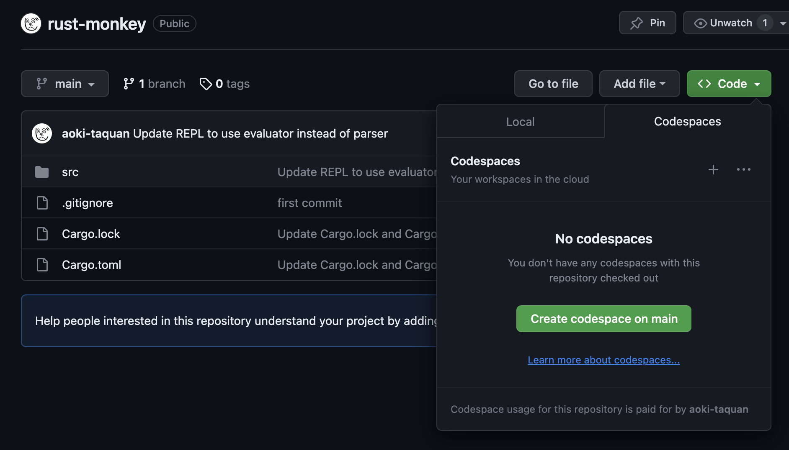

# Rust-monkey

[Go言語でつくるインタプリタ](https://www.oreilly.co.jp/books/9784873118222/) をRustで実装してみたものです。
4章までは実装をしましたが、付録にあるマクロ等の実装はしていません。

## 構文

C like な構文になっており、以下のようなコードが書けます。

詳しい構文に関しては、公式サイトの[What is Monkey?](https://monkeylang.org/#what-is-monkey)を参考にしてください。

## 実行方法

Github Codespaces　を作成しすることで、VS Codeの画面のまま何も設定せずに実行できます。

### Github Codespaces　の作成

このリポジトリを開き、画面右上の「Code」ボタンを押し、「Codespaces」を選択します。
画面に出てくる「Create codespaces on main」を押すと、Github Codespaces　が作成されます。



### 実行

以下のコマンドを実行すると、REPLが起動します。

```bash
cargo run
```

以下のようなものが出力されるので、>>　の後に構文を公式サイトの[What is Monkey?](https://monkeylang.org/#what-is-monkey)にコードを入力してください。

```bash
Hello {username}! This is the Monkey programming language!
>> 
```

## P.S

組込み関数について、まだ実装を行なっていないため、
以下のようなコードは実行できません。

```bash
>> len("Hello World!");
```

```bash
>> puts("Hello World!");
```
